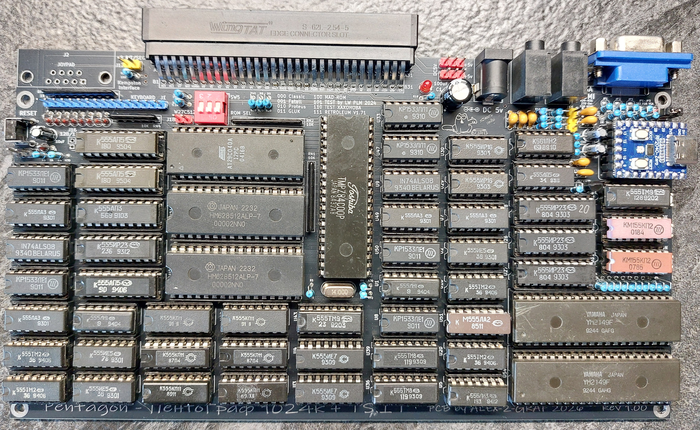
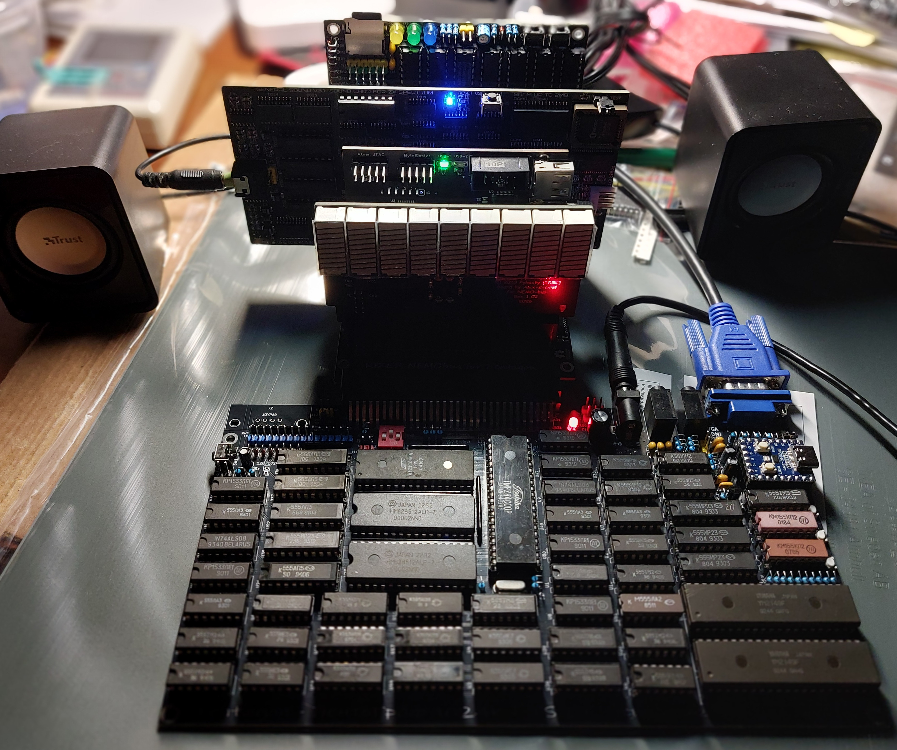
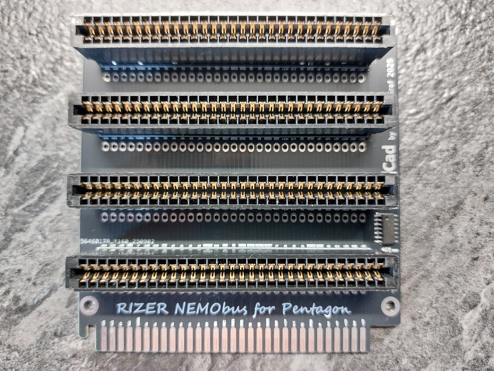
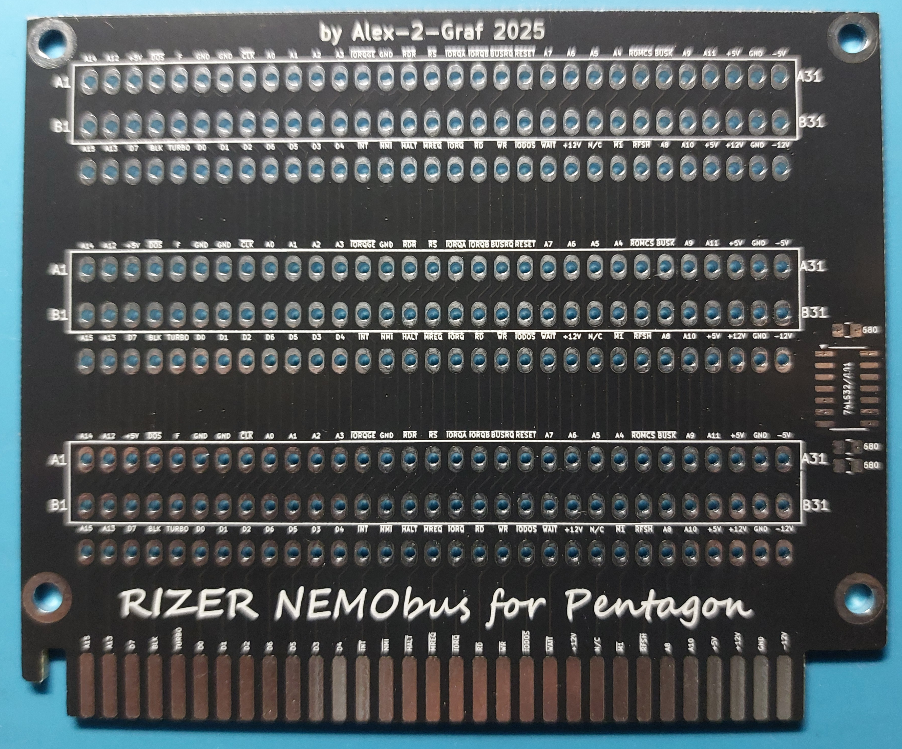
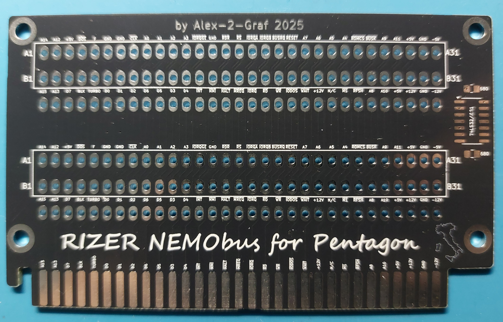
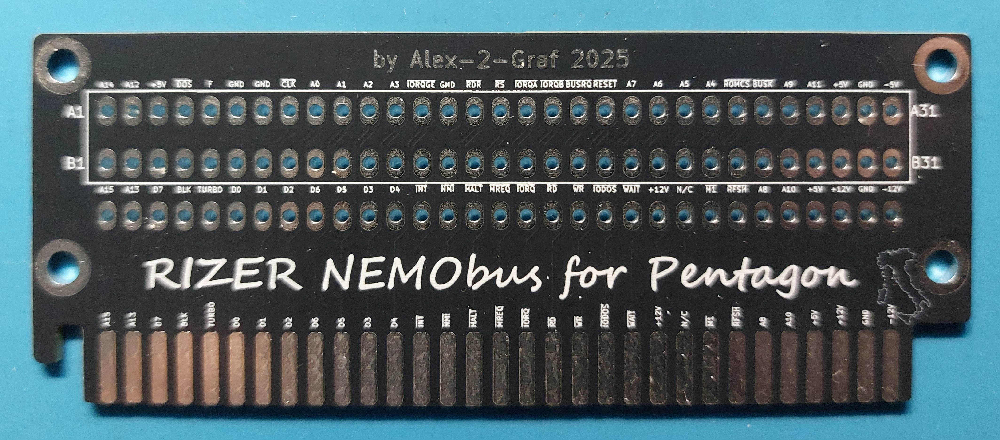

# PentoGraf-Pentagon-1024k
  
## Pentagon ZX Spectrum clone on SRAM with TurboSound and NemoBus in Leningrad-2 (Aurora) form-factor.  
  
> [English](README.en.md) | [Русский](README.md)  
  
# 🛠️ PentoGraf (Pentagon Clone by Alex-2-Graf)  
  
После успешного запуска [Leningrad-2-48k](https://github.com/Alex-2-Graf/LENINGRAD-2-48k) и [Leningrad-2-128k-SRAM](https://github.com/Alex-2-Graf/Leningrad-2-128k-SRAM) встал вопрос с проигрыванием демок.  
  
Все мы знаем, что большинство демосценеров пишут демо под клон Пентагона.

## 📜 Историческая справка / History

**Pentagon (Пентагон)** — самый популярный и культовый советский клон ZX Spectrum, разработанный в Москве в районе 1989–1990 годов.
В отличие от оригинального британского компьютера, Пентагон обладал уникальным таймингом экрана (320 строк в кадре вместо 312 и 71680 тактов за интру вместо 69888). 

Именно эти «неправильные» тайминги дали процессору больше времени на выполнение кода во время прерывания.  
Это сделало Пентагон мировым эталоном для создания сложнейших графических и музыкальных демо (Demoscene).  
До сих пор 99% всех графических эффектов и мультиколоров на постсоветском пространстве пишутся строго под архитектуру Пентагона.
  
Многие предлагали просто переделать тайминги под Пентагон на Авроре.  
Но тогда это будет уже не Ленинград2, но ещё не Пентагон.  
Был выбран другой путь.  
  
**PentoGraf** — авторская модификация культового клона ZX Spectrum «Пентагон».  
Проект является прямым продолжением платы **Aurora** (Ленинград-2 128k SRAM) и переносит легендарную демосценическую архитектуру в компактные габариты и форм-фактор «Ленинграда».
  
**PentoGraf** — это дань уважения легенде, выполненная на надежной статической памяти (SRAM) и упакованная в эргономичные размеры платы «Аврора».

## 💾 Основные особенности

* **Совместимость:** Полное совпадение размеров, крепежных отверстий и разъемов с платой «Аврора» (Ленинград-2). Подходит в те же корпуса, совместима с оригинальными клавиатурами.
* **База компонентов:** 100% классическая мелкая логика («рассыпуха») серий К1533/К555 без использования CPLD/FPGA.
* **Память:** 1024 КБ статического ОЗУ (SRAM) «на борту», что избавляет от проблем со сложной и ненадежной динамической памятью (РУ5/РУ7).
* **Звук:** Интегрированная двухчиповая звуковая система TurboSound (два чипа AY-3-8910/YM2149F).
* **Модернизация:** Полностью удален громоздкий классический контроллер дисковода (FDD).
* **Расширение:** Установлен один системный слот NemoBus для подключения современных периферийных устройств (DivMMC, BDI, PiCard, ZXKM, GeneralSound, ZX-Multisound и др.).
* **RIZER:** Также возможно расширение через Rizer до 4-х устройств

В результате на свет появился PentoGraf  [iBOM 1.01](Export/PentoGraf_1.01.html)   [Схема](Export/PentoGraf_1.01.pdf)   [Gerber](Gerber/PentoGraf_1.01_gerber.zip)  
  
  
  
  
  
Так же целая серия ёлок [iBOM х4](Export/Rizer.html)  [Схема](Export/Rizer.pdf)  
  
[RIZER x4](Gerber/RIZER_x4_Nemobus_Pent_gerber.zip)  
[RIZER x3](Gerber/RIZER_x3_Nemobus_Pent_gerber.zip)  
[RIZER x2](Gerber/RIZER_x2_Nemobus_Pent_gerber.zip)  
[RIZER x1](Gerber/RIZER_x1_Nemobus_Pent_gerber.zip)  

  
  
  
  
  
  
  
  
## ⚖️ Лицензия / License

Этот проект является открытым аппаратным обеспечением (Open Source Hardware). Графические материалы, схемы и топология печатной платы распространяются под лицензией **CERN OHL v2 Weak Reciprocal** (CERN-OHL-W-2.0).

Вы можете свободно распространять, модифицировать и производить это устройство при условии сохранения авторства **Alex-2-Graf** и публикации измененных исходных файлов платы под аналогичной открытой лицензией.
